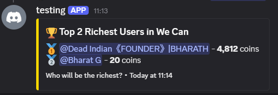

# 🤖 Vaish - Ultra-Modern AI Discord Bot

<div align="center">


**🚀 Meet Vaish - The most advanced, feature-rich Discord bot that you own completely!**  
**✨ No subscriptions • 🔓 Full ownership • 🛡️ Privacy-first • ⚡ Lightning-fast**

[🖼️ Screenshots](#️-screenshots) • [🎯 Features](#-features) • [🔧 Installation](#-installation) • [🌐 Deploy to Render](#-deploy-to-render) • [📖 Commands](#-commands) • [🤝 Contributing](#-contributing)

</div>

---

## 🖼️ Screenshots

<div align="center">

### 🎨 Beautiful User Interface Showcase

<table>
<tr>
<td width="33%">

**💎 Points System**

<i>Modern points giving interface with reason tracking</i>

</td>
<td width="33%">

**📊 User Profiles**

<i>Comprehensive profile with XP, points, and activity stats</i>

</td>
<td width="33%">

**� AI Assistant**

<i>Clean Q&A interface powered by Google Gemini</i>

</td>
</tr>
<tr>
<td width="33%">

**🎫 Ticket System**

<i>Professional ticket creation with status tracking</i>

</td>
<td width="33%">

**📊 Interactive Polls**

<i>Modern Discord components with real-time voting</i>

</td>
<td width="33%">

**🏆 Leaderboards**

<i>Beautiful leaderboards for points and XP rankings</i>

</td>
</tr>
</table>

**🎮 Fun Commands & 🔧 Admin Dashboard**

<table>
<tr>
<td width="50%">

<i>Engaging games and entertainment features powered by Vaish</i>
</td>
<td width="50%">

<i>Comprehensive moderation and configuration tools for Vaish</i>
</td>
</tr>
</table>

</div>

---

## ✨ Why Choose Vaish?

💰 **100% Free Forever** - No monthly subscriptions, no hidden costs, completely free  
🔓 **Complete Ownership** - Every line of code belongs to you, no vendor lock-in  
🛡️ **Privacy First** - Your data stays on your servers, zero data mining  
⚡ **Ultra-Modern Stack** - Built with Discord.js v14, Node.js 18+, and latest technologies  
🎨 **Beautiful UI** - Stunning embeds with modern Discord components and animations  
📈 **Enterprise Scale** - Handles servers from 10 to 100,000+ members effortlessly  
🗄️ **Advanced Database** - MongoDB with intelligent caching and data persistence  
🤖 **AI Superpowers** - Google Gemini integration for intelligent responses  
🔧 **Developer Friendly** - Clean code, extensive documentation, easy to customize  
🌐 **Cloud Ready** - Deploy anywhere - Render, Railway, Heroku, or your own VPS

---

## 🎯 Core Features

### **🤖 Advanced AI Assistant (Google Gemini Pro)**

- **Intelligent Q&A** - Ask anything and get smart, context-aware responses
- **Rate Limiting** - Built-in protection against spam and abuse
- **Error Recovery** - Graceful handling of API limits and failures
- **Conversation Memory** - Maintains context for better interactions
- **Multi-Language** - Supports questions and responses in multiple languages

### **💎 Advanced Points & Rewards**

- **Daily Rewards** - Claim daily points with streak bonuses
- **Point Economy** - Trade points between users with transaction history
- **Leaderboards** - Server-wide rankings with seasonal resets
- **Achievement System** - Unlock rewards for various activities
- **Customizable** - Admins can adjust point rates and rewards

### **📊 Professional XP & Leveling**

- **Multi-Activity Tracking** - Messages, voice time, reactions, and more
- **Dynamic Role Rewards** - Automatic role assignment based on levels
- **Progress Visualization** - Beautiful progress bars and level-up animations
- **Statistics Dashboard** - Detailed analytics for users and admins
- **Seasonal Events** - Special XP bonuses during holidays and events

### **🎫 Enterprise Ticket System**

- **Smart Ticketing** - Professional support ticket management
- **Category Organization** - Multiple ticket types with custom workflows
- **Team Collaboration** - Assign tickets to staff members
- **Ticket Analytics** - Response times, resolution rates, satisfaction scores
- **Auto-Archiving** - Intelligent cleanup of resolved tickets

### **�️ Intelligent Moderation**

- **AI-Powered Anti-Raid** - Detects and stops raids automatically
- **Smart Filters** - Content filtering with context awareness
- **Bulk Operations** - Mass ban, kick, and message cleanup tools
- **Audit Logging** - Comprehensive logs of all moderation actions
- **Appeal System** - Built-in appeal process for banned users

### **� Interactive Entertainment**

- **Modern Games** - 8ball, dice, truth-or-dare with beautiful interfaces
- **Polls & Surveys** - Interactive polls with real-time results
- **Meme Integration** - Fresh memes from multiple sources
- **Custom Commands** - Server-specific commands and responses
- **Event System** - Automated events and celebrations

---

## 📖 Complete Command List (27 Commands)

<div align="center">

### 🎯 All Available Commands

</div>

| #   | Command            | Category          | Description                                                      | Usage                               |
| --- | ------------------ | ----------------- | ---------------------------------------------------------------- | ----------------------------------- |
| 1   | `/aiassistant`     | 🤖 **AI**         | Ask the AI assistant anything!                                   | `/aiassistant ask <question>`       |
| 2   | `/antiraid`        | 🛡️ **Moderation** | Simple anti-raid protection                                      | `/antiraid <enable/disable/status>` |
| 3   | `/8ball`           | 🎮 **Fun**        | Ask the magic 8-ball a question and receive mystical wisdom      | `/8ball <question>`                 |
| 4   | `/avatar`          | 🖼️ **Utility**    | Display a user's avatar in high quality                          | `/avatar [@user]`                   |
| 5   | `/meme`            | 😂 **Fun**        | Get a random meme to brighten your day                           | `/meme`                             |
| 6   | `/poll`            | 📊 **Utility**    | Create interactive polls with emoji reactions                    | `/poll <question> <options>`        |
| 7   | `/reminder`        | ⏰ **Utility**    | Set a personal reminder with timed DM alerts                     | `/reminder <time> <message>`        |
| 8   | `/roll`            | 🎲 **Fun**        | Roll dice with animated results (supports multiple dice formats) | `/roll [sides]`                     |
| 9   | `/secret`          | 🤫 **Fun**        | Discover a hidden easter egg... if you dare!                     | `/secret`                           |
| 10  | `/birthday`        | 🎂 **Community**  | Manage birthdays in the server                                   | `/birthday <subcommand>`            |
| 11  | `/botstats`        | 📊 **Utility**    | View detailed bot performance statistics and metrics             | `/botstats`                         |
| 12  | `/feedback`        | 📝 **Utility**    | Submit feedback about the bot using an interactive form          | `/feedback`                         |
| 13  | `/help`            | 📚 **Utility**    | Get help with bot commands and features                          | `/help`                             |
| 14  | `/ping`            | 🏓 **Utility**    | Check bot latency and response time with style                   | `/ping`                             |
| 15  | `/serverinfo`      | 🏰 **Utility**    | Display detailed server information and statistics               | `/serverinfo`                       |
| 16  | `/userinfo`        | � **Utility**     | Display detailed information about a user                        | `/userinfo [@user]`                 |
| 17  | `/ban`             | 🔨 **Moderation** | Ban a user from the server with optional reason                  | `/ban @user [reason] [delete_days]` |
| 18  | `/kick`            | 👢 **Moderation** | Kick a user from the server with optional reason                 | `/kick @user [reason]`              |
| 19  | `/purge`           | 🗑️ **Moderation** | Bulk delete messages from the current channel                    | `/purge <amount> [@user]`           |
| 20  | `/ticket`          | 🎫 **Support**    | Create a support ticket                                          | `/ticket <title> <description>`     |
| 21  | `/ticketdashboard` | 🎛️ **Support**    | Manage all server tickets (Moderators Only)                      | `/ticketdashboard <action>`         |
| 22  | `/truthordare`     | 🎮 **Fun**        | Play Truth or Dare!                                              | `/truthordare <subcommand>`         |
| 23  | `/daily`           | 💰 **Rewards**    | Claim your daily points reward                                   | `/daily`                            |
| 24  | `/points`          | 💎 **Rewards**    | Manage and view points system                                    | `/points <give/view/leaderboard>`   |
| 25  | `/profile`         | 📊 **Social**     | View detailed user profile and statistics                        | `/profile [@user]`                  |
| 26  | `/roles`           | 🎭 **XP System**  | View your available role rewards and current progress            | `/roles`                            |
| 27  | `/xpconfig`        | 🎯 **XP System**  | Configure the XP and role reward system                          | `/xpconfig` (Admin only)            |

<div align="center">

### 📊 Command Categories Breakdown

| Category              | Count | Examples                                   |
| --------------------- | ----- | ------------------------------------------ |
| 🎮 **Fun & Games**    | 5     | 8ball, meme, roll, secret, truthordare     |
| 🛡️ **Moderation**     | 4     | antiraid, ban, kick, purge                 |
| 📊 **Utility & Info** | 7     | help, ping, userinfo, serverinfo, botstats |
| 💎 **Rewards & XP**   | 4     | daily, points, profile, xpconfig           |
| 🎫 **Support System** | 2     | ticket, ticketdashboard                    |
| 🤖 **AI Assistant**   | 1     | aiassistant                                |
| 🎂 **Community**      | 1     | birthday                                   |
| 🎭 **Role System**    | 1     | roles                                      |
| ⏰ **Reminders**      | 1     | reminder                                   |
| 📝 **Feedback**       | 1     | feedback                                   |

**Total: 27 Commands** across 10 categories

</div>

---

## Quick Start

### Prerequisites

- **Node.js** v16.0.0 or higher
- **MongoDB** database (local or cloud)
- **Discord Bot Token** ([Get one here](https://discord.com/developers/applications))
- **Google Gemini API Key** ([Get one here](https://makersuite.google.com/app/apikey))

### Installation

1. **Clone the repository**

   ```bash
   git clone https://github.com/yourusername/vaish-discord-bot.git
   cd vaish-discord-bot
   ```

2. **Install dependencies**

   ```bash
   npm install
   ```

3. **Configure environment variables**

   Create a `.env` file:

   ```env
   DISCORD_TOKEN=your_discord_bot_token_here
   CLIENT_ID=your_bot_client_id_here
   GUILD_ID=your_test_guild_id_here
   MONGODB_URI=your_mongodb_connection_string
   GEMINI_API_KEY=your_gemini_api_key_here
   ```

4. **Deploy slash commands**

   ```bash
   node deploy-commands.js
   ```

5. **Start the bot**
   ```bash
   npm start
   ```

---

## 🌐 Deploy to Render (Free)

Deploy your bot for free on Render with these simple steps:

### Step 1: Prepare Your Repository

1. Fork this repository to your GitHub account
2. Clone your fork locally and configure your `.env` file

### Step 2: Deploy on Render

1. Go to [Render.com](https://render.com) and sign up
2. Click "New +" → "Web Service"
3. Connect your GitHub repository
4. Configure your service:
   ```
   Name: Vaish - Ultra-Modern AI Discord Bot
   Environment: Node
   Build Command: npm install
   Start Command: node index.js
   ```

### Step 3: Set Environment Variables

Add these environment variables in Render dashboard:

- `DISCORD_TOKEN` - Your Discord bot token
- `CLIENT_ID` - Your bot's client ID
- `MONGODB_URI` - Your MongoDB connection string
- `GEMINI_API_KEY` - Your Google Gemini API key

### Step 4: Deploy Commands

After first deployment, run this once in Render shell:

```bash
node deploy-commands.js
```

### 💡 Render Configuration Tips

- **Auto-Deploy**: Enable auto-deploy for seamless updates
- **Health Check**: Set health check path to `/` if you add a web endpoint
- **Environment**: Production environment for better performance
- **Scaling**: Free tier includes 512MB RAM and shared CPU

---

## 🔧 Database Setup

### MongoDB Options

**Option 1: MongoDB Atlas (Recommended)**

1. Go to [MongoDB Atlas](https://cloud.mongodb.com)
2. Create free account and cluster
3. Get connection string and add to `.env`

**Option 2: Local MongoDB**

```bash
# Install MongoDB locally
npm install -g mongodb
mongod --dbpath ./data
```

**Option 3: Railway MongoDB**

1. Create Railway account
2. Add MongoDB service
3. Copy connection string to `.env`

### Database Features

- **Automatic Schema Creation** - Tables created automatically
- **Data Persistence** - All user data, XP, points, tickets stored
- **Backup Ready** - Easy export/import capabilities
- **Scalable** - Handles unlimited users and servers

---

## 🎮 Advanced Configuration

### AI Assistant Setup

1. Get Gemini API key from [Google AI Studio](https://makersuite.google.com/app/apikey)
2. Add to environment variables
3. Bot automatically handles rate limiting and errors

### XP System Configuration

```javascript
// Configure XP rates (Admin only)
/xpconfig
- XP per message: 1-10
- XP per voice minute: 1-20
- Role automation: Enable/Disable
```

### Points System Features

- **Daily Rewards**: 50-200 points daily
- **Point Trading**: Users can gift points
- **Leaderboards**: Server-wide rankings
- **Future Ready**: Framework for point shops

---

## 🔮 Future Features

### 🤖 **Enhanced AI Learning**

- **FAQ Training** - Bot will learn from your server's frequently asked questions and user chats
- **Custom Responses** - Fine-tuned responses based on your community's specific needs
- **Context Awareness** - Remember conversation history for better customer support experience
- **Smart Learning** - Analyze user interactions to provide better, more relevant answers
- **Multi-Language** - Support for multiple languages in responses

### 🗄️ **Redis Integration**

- **Ultra-Fast Caching** - Blazing fast command responses
- **Session Management** - Better user state tracking
- **Rate Limiting** - Advanced spam protection
- **Real-time Features** - Live notifications and updates

### 📈 **Expansion Goals**

- **100+ Commands** - Comprehensive bot functionality
- **Custom Modules** - Plugin system for custom features
- **Web Dashboard** - Browser-based configuration panel
- **Analytics** - Detailed server analytics and insights

### 🎯 **Community Features**

- **Economy System** - Virtual currency and shops
- **Mini Games** - Interactive games with rewards
- **Event System** - Automated events and celebrations
- **Custom Roles** - Dynamic role assignment system

---

## 🛠️ Technical Architecture

### **Modern Tech Stack**

- **Discord.js v14** - Latest Discord API wrapper
- **Node.js 18+** - Modern JavaScript runtime
- **MongoDB** - NoSQL database for flexibility
- **Google Gemini AI** - Advanced language model
- **Mongoose** - Elegant MongoDB object modeling

### **Performance Features**

- **Command Cooldowns** - Prevent spam and abuse
- **Error Handling** - Graceful error recovery
- **Memory Management** - Efficient resource usage
- **Auto-Restart** - Built-in crash recovery
- **Logging System** - Comprehensive activity logs

### **Security Measures**

- **Permission Validation** - Multi-layer permission checks
- **Input Sanitization** - Prevent injection attacks
- **Rate Limiting** - Protect against abuse
- **Data Encryption** - Secure sensitive information

---

## 🤝 Contributing

We welcome contributions from developers of all skill levels! This project embodies the open-source philosophy of community-driven development.

### 🌟 Open Source Philosophy

**Why Open Source?**

- 💰 **No Subscriptions** - Stop paying monthly fees for basic bot features
- 🔓 **Full Control** - Own your bot's code and data completely
- 🛡️ **Privacy** - Your server data stays with you
- 🚀 **Innovation** - Community-driven feature development
- 📚 **Learning** - Perfect for developers to learn and grow

### Getting Started

1. **Fork** the repository
2. **Clone** your fork locally
3. **Create** a feature branch (`git checkout -b feature/amazing-feature`)
4. **Code** your improvements
5. **Test** thoroughly
6. **Commit** with descriptive messages
7. **Push** to your branch
8. **Submit** a Pull Request

### Development Guidelines

- **Code Style**: Consistent formatting with Prettier
- **Documentation**: Update README for new features
- **Testing**: Test all new commands thoroughly
- **Error Handling**: Implement robust error handling
- **Database**: Follow existing schema patterns

### Ways to Contribute

- 🐛 **Bug Fixes** - Help squash bugs and improve stability
- ✨ **New Features** - Add exciting new commands and capabilities
- 📚 **Documentation** - Improve guides and documentation
- 🎨 **UI/UX** - Enhance embed designs and user experience
- 🔧 **Performance** - Optimize code and database queries
- 🌐 **Translations** - Add support for more languages

---

## 📞 Support & Community

### Get Help

- 📖 **Documentation** - Check this README first
- 🐛 **Bug Reports** - [Create an issue](https://github.com/vaish-bot/discord-bot/issues)
- 💡 **Feature Requests** - Share your ideas with the community
- 💬 **Discord Server** - Join our community server for live help

### Community Guidelines

- **Be Respectful** - Treat all community members with respect
- **Be Helpful** - Share knowledge and help newcomers
- **Be Patient** - Remember everyone is learning
- **Be Constructive** - Provide actionable feedback and suggestions

---

## 📄 License

This project is licensed under the **MIT License** - see the [LICENSE](LICENSE) file for details.

**What this means:**

- ✅ **Commercial Use** - Use in commercial projects
- ✅ **Modification** - Modify the code as needed
- ✅ **Distribution** - Share with others
- ✅ **Private Use** - Use for personal projects
- ✅ **Attribution** - Just keep the license notice

---

## 🏆 Acknowledgments

### **Technologies Used**

- **[Discord.js](https://discord.js.org/)** - Powerful Discord API wrapper
- **[Node.js](https://nodejs.org/)** - JavaScript runtime environment
- **[MongoDB](https://www.mongodb.com/)** - NoSQL database
- **[Google Gemini](https://ai.google.dev/)** - Advanced AI language model
- **[Mongoose](https://mongoosejs.com/)** - MongoDB object modeling

### **Special Thanks**

- **Discord Developer Community** - For inspiration and support
- **Open Source Contributors** - For making this project possible
- **Beta Testers** - For helping improve the bot
- **You** - For choosing open source over proprietary solutions!

---

<div align="center">

## 🚀 Ready to Deploy Your Own Bot?

### Free • Open Source • Community Driven

**Clone this repository and deploy to Render in under 10 minutes!**

[🌟 Star this repo](https://github.com/vaish-bot/discord-bot) • [🍴 Fork & Deploy](https://github.com/vaish-bot/discord-bot/fork) • [📖 Read the docs](#-quick-start)

---

### 📊 Project Stats


---

_Built with ❤️ by the Vaish development team_  
_"Empowering Discord communities with free, powerful, and intelligent bot solutions"_

</div>
